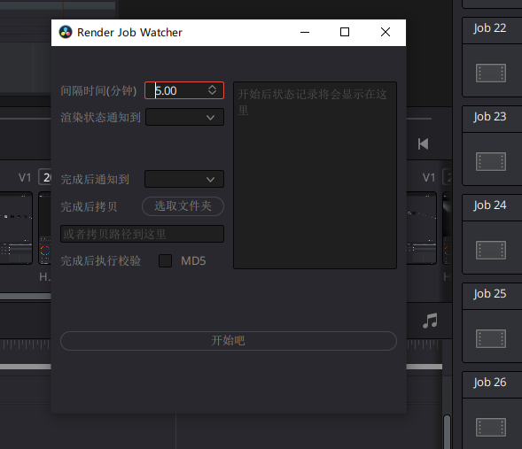
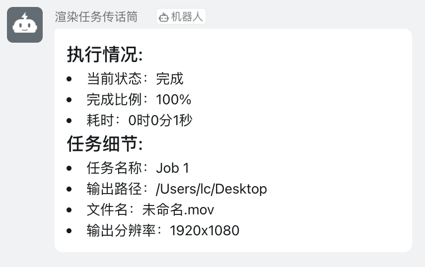
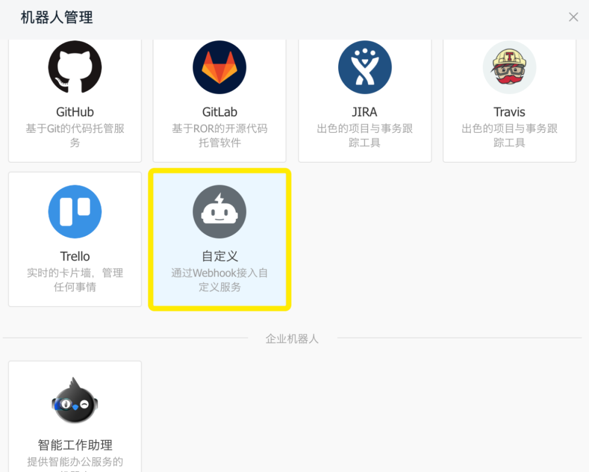
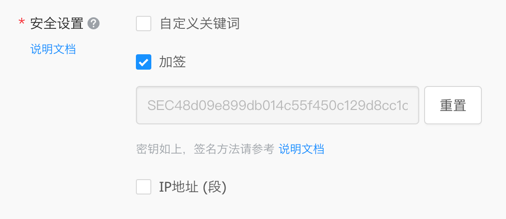
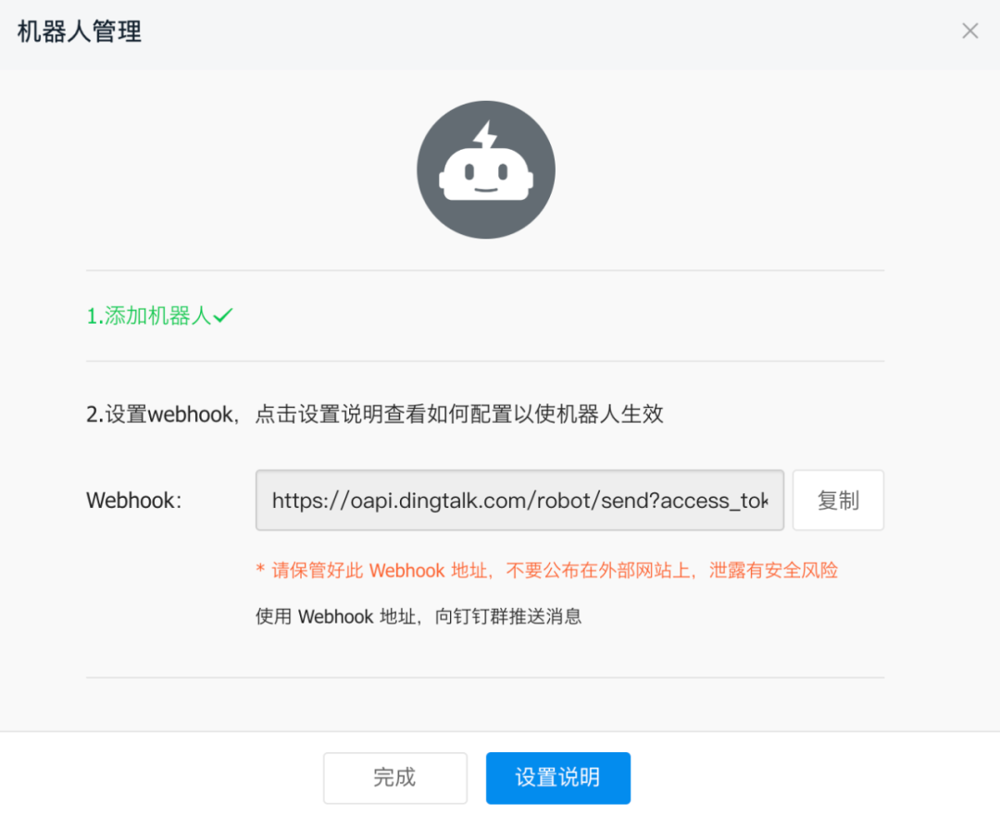
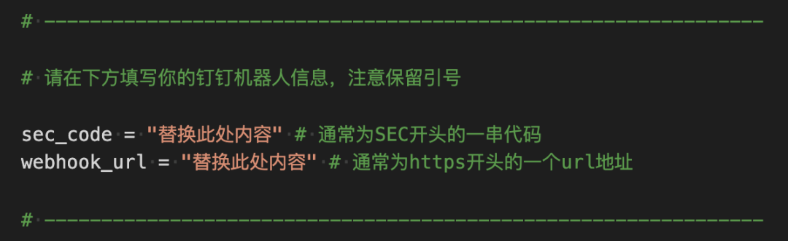
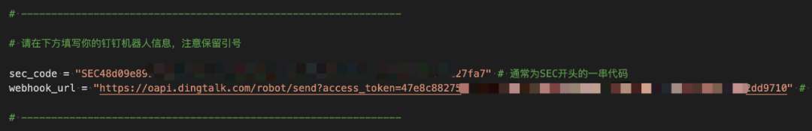

*本期内容可能需要安装额外的Python库&nbsp;

&nbsp;

感觉这是一篇来晚了的文章……why

&nbsp;

熟悉小黄灯的朋友们都知道，老早之前就为大家介绍过，我们可以借助 Python API 来干很多事，[当时也向大家展示了一些可实现的内容（详情请点击）](http://mp.weixin.qq.com/s?__biz=MzI5NTc5MjI4MQ==&mid=2247484902&idx=1&sn=0f2ff77980f30972d4d403ead61feeae&chksm=ec4f7e10db38f706158a388d6ee1c72c4021ded7e783a9324be4b4b947adbe3e4d80ed7d7544&scene=21#wechat_redirect)&nbsp;

&nbsp;

在其中有个flag立好但迟迟没有下文的渲染监视工具👇

&nbsp;



&nbsp;

工程为何逐渐烂尾 脚本为何蒙上灰尘

是____的沦丧 还是_____的扭曲？

&nbsp;

&nbsp;

&nbsp;

这一切的背后到底是因为……&nbsp;

&nbsp;

&nbsp;

&nbsp;

&nbsp;

&nbsp;

&nbsp;

&nbsp;

&nbsp;


## 🌚达芬奇17自带了啊朋友们🌚

&nbsp;

&nbsp;

&nbsp;

&nbsp;

所以问题就变成了&nbsp;

&nbsp;

&nbsp;

&nbsp;

# **“我都用17这么久了哪看到有你说的这玩意”**

&nbsp;

所以新增的一大堆功能里面，在渲染设置里一个不起眼的位置上，为我们提供一个**渲染任务触发器**的一个设计。也就是说可以指定达芬奇在开始或结束渲染时，自动做一件什么事情。&nbsp;

&nbsp;


&nbsp;

辣么此时各位就可以尽情地展开想象力，看有哪些事可以在开始或结束渲染时执行，比如

&nbsp;

*   开始前完成磁盘空间的检查
  &nbsp;
*   结束后拷贝到指定位置并校验
  &nbsp;
*   开始前读取手环确认心率是否正常&nbsp;
  &nbsp;
*   结束后自动发送邮件给客户提醒结款&nbsp;
  &nbsp;

&nbsp;

&nbsp;

&nbsp;

# **“我懒得想”**

&nbsp;

一口气把所有功能都放到一个选项里显然不现实；按照众所周知的小黄灯更新频率显然更不会给大家来个大礼包（万一呢&nbsp;

&nbsp;

行吧那这里先给大家分享一个**钉钉通知jio本**好了，效果是这样的

&nbsp;




&nbsp;

做到的事很简单：在渲染完成后将该渲染任务的情况发布到钉钉上。

&nbsp;

这里利用的是钉钉机器人的特性，可以在钉钉群里让大家都可以看到渲染状况（群里也可以只有你一个人），[相比于别的通知实现方式](http://mp.weixin.qq.com/s?__biz=MzI5NTc5MjI4MQ==&mid=2247484532&idx=1&sn=2fcb7edc8dd650a06dc45eca3c43129a&chksm=ec4f7f82db38f6944068261bbe0aef1f6e2ec905baaebe7d190c05855ca1005e85112f6bbb39&scene=21#wechat_redirect)更加稳定且及时（具体视当前使用网络环境而定）

&nbsp;

&nbsp;

&nbsp;

# **“那么我要怎么准备呢？”**

&nbsp;

首先钉钉机器人的创建非常简单，这里给个官方指导传送门，大家照着一步步操作即可

&nbsp;


&nbsp;

> TIPS：
> 
> 创建的入口仅限电脑端，移动端暂无(更新：iOS端有了)
> 
> 创建的入口时不时会抽风挂掉，可以趁早新建一个，如果不行就得等等&nbsp;

&nbsp;

创建的设置中需要注意的是&nbsp;

&nbsp;



&nbsp;

类型选择【自定义】

&nbsp;



&nbsp;

在安全设置中，请勾选【加签】方式，并复制出这一段密钥&nbsp;

&nbsp;

同时还需要复制下来的是机器人的webhook地址（请注意阅读安全提示）

&nbsp;



&nbsp;

记下这两段之后，打开任意文本编辑器，将二者填写到文末下载到的脚本里，保存

&nbsp;



&nbsp;

&nbsp;

比如&nbsp;

&nbsp;



&nbsp;

随后将该脚本存放到以下路径就好啦（必须）

&nbsp;

&nbsp;

```
macOS:   ~/Library/Application Support/Blackmagic Design/DaVinci Resolve/Fusion/Scripts/Deliver
Windows: %APPDATA%\Blackmagic Design\DaVinci Resolve\Fusion\Scripts\Deliver
```

&nbsp;

顺利的话我们就可以在渲染设置页面中的下拉选项里头看到它了

&nbsp;


&nbsp;

&nbsp;

&nbsp;

&nbsp;

# **“我是进阶玩家”**&nbsp;

&nbsp;

想必你可能不会满足于上图所示的钉钉通知内容/形式，没关系，我也帮大家先找到了以下参考方便各位进一步折腾&nbsp;

&nbsp;


&nbsp;

自定义机器人的官方折腾说明&nbsp;

&nbsp;

对于消息类型，脚本中我使用的是markdown类型，由于钉钉对markdown的支持并没有非常的完善，不支持所有markdown语法，同时电脑、移动端同步显示也存在一定的差异（表格）。

&nbsp;

关于内容本身，其实大家可以自行根据各自所需修改脚本，达芬奇实际上提供了更全面的属性可提取，例如

&nbsp;

```
{
'JobStatus': '完成', # 视达芬奇UI语言而定
'CompletionPercentage': 100, 
'TimeTakenToRenderInMs': 1749,
'JobId': '77395d9f-b741-482a-b826-c995b1aab7fc', 
'RenderJobName': 'Job 1', 
'TimelineName': 'Timeline 1', 
'TargetDir': '/Users/lc/Desktop', 
'IsExportVideo': True, 
'IsExportAudio': True, 
'FormatWidth': 1920, 
'FormatHeight': 1080, 
'FrameRate': '24', 
'PixelAspectRatio': 1.0, 
'MarkIn': 86400, 'MarkOut': 86519, 
'AudioBitDepth': 16, 'AudioSampleRate': 48000, 
'OutputFilename': 'Test.mov', 
'RenderMode': 'Single clip', 
'PresetName': 'Custom', 
'VideoFormat': 'QuickTime', 
'VideoCodec': 'H.264', 'AudioCodec': 'lpcm'
}
```

&nbsp;

# **“所以哪里可以搞到呢”**

[点这里跳转到Github页面](https://github.com/laciechang/Resolve-render-notification-to-Dingding)

如果你乐于💰支持我一杯咖啡☕️

欢迎访问我的🍞面包多页面🍞

其中会附赠【达芬奇开发兴趣班/售后群】

&nbsp;


&nbsp;

&nbsp;

⚠️重要提示⚠️

凡在使用过程中如遇到脚本bug（完全不会用的除外啊...）

请及时访问GitHub页面催更/看有没有更新 或者直接进群造访
